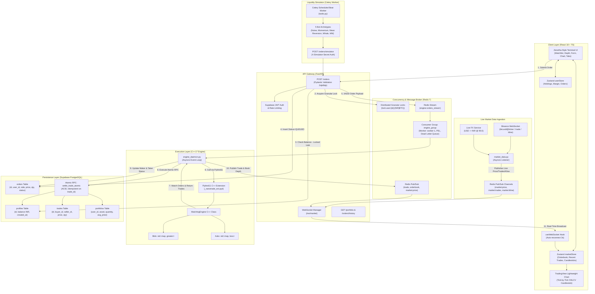

# NanoTrade — Master Interview Preparation & System Design Guide

> **Target Audience:** Hiring Managers, Tech Leads, System Design Interviewers, and Recruiter Screenings.  
> **Applicable Roles:** Full-Stack Engineer, Backend Engineer, Distributed Systems Engineer, High-Performance / FinTech C++ Engineer, Frontend Engineer.

---

## 📑 Table of Contents
1. [Executive Summary & Elevator Pitches](#1-executive-summary--elevator-pitches)
2. [End-to-End System Architecture](#2-end-to-end-system-architecture)
3. [Component Deep Dives](#3-component-deep-dives)
   - [3.1 C++ Matching Engine & Microstructure](#31-c-matching-engine--microstructure)
   - [3.2 Pybind11 Interoperability Bridge](#32-pybind11-interoperability-bridge)
   - [3.3 Asynchronous FastAPI Gateway](#33-asynchronous-fastapi-gateway)
   - [3.4 Redis Distributed Stream & Engine Daemon](#34-redis-distributed-stream--engine-daemon)
   - [3.5 Atomic Trade Settlement & PostgreSQL RPC](#35-atomic-trade-settlement--postgresql-rpc)
   - [3.6 Market Simulation Engine & Liquidity Bots](#36-market-simulation-engine--liquidity-bots)
   - [3.7 Real-Time Data Pipeline & Binance Bridge](#37-real-time-data-pipeline--binance-bridge)
   - [3.8 Frontend Architecture (React 18 + Zustand + Lightweight Charts)](#38-frontend-architecture-react-18--zustand--lightweight-charts)
4. [Concurrency, Reliability & Distributed Systems Edge Cases](#4-concurrency-reliability--distributed-systems-edge-cases)
5. [Tech Stack Justification & Trade-Off Analysis](#5-tech-stack-justification--trade-off-analysis)
6. [Top 35+ Technical Interview Questions & High-Scoring Answers](#6-top-35-technical-interview-questions--high-scoring-answers)
   - [Category A: Project Pitch & Resume Questions](#category-a-project-pitch--resume-questions)
   - [Category B: System Design & Architecture](#category-b-system-design--architecture)
   - [Category C: C++ & Low-Latency Matching Engine](#category-c-c--low-latency-matching-engine)
   - [Category D: Backend, Redis Streams & Database Concurrency](#category-d-backend-redis-streams--database-concurrency)
   - [Category E: Frontend, WebSockets & UI Performance](#category-e-frontend-websockets--ui-performance)
   - [Category F: Failure Scenarios, Edge Cases & Recovery](#category-f-failure-scenarios-edge-cases--recovery)
7. [Glossary of Trading & Systems Terminology](#7-glossary-of-trading--systems-terminology)

---

## 1. Executive Summary & Elevator Pitches

### 30-Second Elevator Pitch
> *"NanoTrade is a high-throughput, real-time crypto paper-trading platform designed with a dual-tier architecture. It features a custom low-latency C++ matching engine that executes orders using Price-Time Priority, integrated into an asynchronous Python/FastAPI ecosystem via Pybind11. The system uses Redis Streams for durable order ingestion, an idempotent PostgreSQL RPC for atomic balance and portfolio settlement, and an automated multi-agent liquidity simulator anchored to live Binance feeds converted to INR. On the frontend, it delivers a Zerodha-inspired terminal built in React 18, TypeScript, Zustand, and TradingView Lightweight Charts, streaming sub-millisecond market depth and tick data over WebSockets."*

### 2-Minute Deep Dive Pitch
> *"Most paper trading platforms either poll dummy REST endpoints or execute orders against static market prices with zero slippage or market depth. I built NanoTrade to mirror the genuine market microstructure of an institutional crypto exchange.*
> 
> *The core execution engine is written in modern C++17, maintaining bid and ask books in price-ordered red-black trees (`std::map`) holding FIFO queues of limit orders. To connect this to web services without IPC overhead, I compiled it into a native Python C-extension via Pybind11.*
> 
> *When an order is submitted, FastAPI first acquires a distributed Redis lock on the user's specific asset (INR for buys, BTC for sells) to eliminate double-spending. After verifying available margins against pending liabilities, the order is appended to a Redis Stream. A dedicated background Engine Daemon pulls from this stream using Redis Consumer Groups, feeds orders to the C++ engine, and executes trades.*
> 
> *Trade settlement is completely atomic: an idempotent PostgreSQL stored procedure (`settle_trade_atomic`) adjusts buyer/seller fiat balances, updates weighted-average purchase prices in portfolios, and records the trade in a single ACID transaction. If the engine ever crashes, it hydrates its in-memory books directly from the database and claims stale unacknowledged messages via Redis PEL.*
> 
> *To provide continuous market depth, a Celery worker simulates 5 distinct trader personalities—Noise, Momentum, Mean Reversion, Whales, and Market Makers—placing synthetic orders around live Binance BTC/USDT prices converted to INR via live forex rates.*
> 
> *The frontend is a data-dense terminal crafted with React 18, Tailwind CSS, shadcn/ui primitives, and Zustand dual stores. It ingests orderbook snapshots, trade feeds, and candlestick ticks over WebSockets, updating TradingView Lightweight Charts in real-time."*

---

## 2. End-to-End System Architecture



---

## 3. Component Deep Dives

### 3.1 C++ Matching Engine & Microstructure

#### Core Data Structures
The in-memory order book (`include/engine/OrderBook.h`) implements strict **Price-Time Priority (FIFO)**:
```cpp
// Buy orders: Highest price first (Descending order)
std::map<double, std::queue<Order>, std::greater<double>> bids;

// Sell orders: Lowest price first (Ascending order)
std::map<double, std::queue<Order>> asks;
```

#### Algorithmic Complexity:
| Operation | Data Structure | Time Complexity | Rationale |
| :--- | :--- | :--- | :--- |
| **Best Bid / Ask Lookup** | `std::map::begin()` | $\mathcal{O}(1)$ | Returns the root/extreme node in the Red-Black Tree. |
| **Insert New Price Level** | `std::map::insert()` | $\mathcal{O}(\log P)$ | $P$ = distinct price levels in the book. |
| **Enqueue Order at Level** | `std::queue::push()` | $\mathcal{O}(1)$ | Standard FIFO queue push at existing price level. |
| **Fill / Match Top Order** | `std::queue::pop()` | $\mathcal{O}(1)$ | Removes head order when fully filled. |
| **Delete Empty Price Level**| `std::map::erase()` | $\mathcal{O}(\log P)$ | Rebalances Red-Black Tree when a price queue empties. |

#### Matching Logic (`src/engine/MatchingEngine.cpp`):
1. **Lock Acquisition:** `std::lock_guard<std::mutex> lock(engineMutex)` ensures strict sequential thread safety.
2. **Side Branching:**
   - **Incoming BUY (Taker):** Compares against `getBestAsk()`. While `remainingQty > 0` and `bestAsk.price <= taker.price`:
     - Calculates fill: `tradedQty = std::min(remainingQty, bestAsk.quantity)`.
     - Generates UUID v4 trade record with trade timestamp.
     - Decrements taker and maker quantities.
     - If maker order reaches 0, calls `removeBestAsk()`. If partially filled, calls `updateBestAsk()`.
   - **Incoming SELL (Taker):** Compares against `getBestBid()`. While `remainingQty > 0` and `bestBid.price >= taker.price`:
     - Matches at the maker's price (`bestBid.price`), ensuring price improvement for aggressive orders.
3. **Resting Book Insertion:** Any unfulfilled quantity is enqueued to `bids` or `asks` as a resting maker order (`result.fillStatus` becomes `PARTIALLY_FILLED` or `NEW`).

---

### 3.2 Pybind11 Interoperability Bridge

Instead of utilizing cross-process IPC, Unix sockets, or gRPC (which introduce network serialization overhead and context switches), NanoTrade compiles C++ into a native shared library (`_nanotrade_ext.pyd` on Windows / `.so` on Linux) using **Pybind11**.

#### Exposed Types (`src/bindings.cpp`):
- `OrderType`: C++ enum `BUY`, `SELL`.
- `Order`: Attributes `order_id`, `price`, `quantity` (scaled integer), `timestamp`, `user_id`, `is_user`.
- `Trade`: Attributes `trade_id`, `buy_order_id`, `sell_order_id`, `price`, `quantity`, `timestamp`, `buyer_id`, `seller_id`.
- `MatchingEngine`: Methods `process_order(Order) -> ProcessResult`, `get_order_book() -> str (JSON)`, `get_last_traded_price() -> double`.

#### Zero-Copy & C++ Standard Compatibility:
- Uses `compat/optional.h` for portable C++11/C++14/C++17 compatibility.
- Uses `nlohmann::json` for lightning-fast depth serialization without manual string concats.

---

### 3.3 Asynchronous FastAPI Gateway

The web server (`python/app/main.py`) exposes high-performance asynchronous endpoints powered by Starlette and Uvicorn.

#### Key Architectural Highlights:
1. **Pydantic Validation (`OrderCreate`):**
   - Price must be positive float, rounded to 2 decimal places (`validate_price_precision`).
   - Quantity must be positive float with max 6 decimal places (`validate_quantity_precision`).
2. **Granular Distributed Locks (`order_service.py`):**
   - Avoids global locking. Uses Redis distributed locks keyed by user and asset:
     - `lock:user:{user_id}:INR` for BUY orders.
     - `lock:user:{user_id}:BTC` for SELL orders.
   - Prevents race conditions where a user rapidly submits parallel orders to overspend their margin.
3. **Pre-Execution Margin Validation (`portfolio_service.py`):**
   - Real-time calculation:
     $$\text{Available Margin} = \text{Wallet Balance} - \sum (\text{Pending Limit Buy Orders} \times \text{Price})$$
     $$\text{Available BTC} = \text{Portfolio Quantity} - \sum (\text{Pending Limit Sell Orders})$$
   - Rejects orders with `400 Bad Request` prior to enqueueing.

---

### 3.4 Redis Distributed Stream & Engine Daemon

The system decouples synchronous HTTP requests from order execution via **Redis Streams** (`engine:orders_stream`).

#### Why Redis Streams over Redis Pub/Sub for Orders?
- **Pub/Sub is ephemeral (Fire & Forget):** If the worker is restarting, orders are permanently lost.
- **Streams are append-only logs:** Guaranteed persistence, message ACK (`XACK`), and consumer tracking.

#### Execution Flow (`engine_daemon.py`):
1. **Consumer Group:** Orders are consumed via `XREADGROUP` under `engine_group`.
2. **Status Transition:** Database order status is marked as `PROCESSING`.
3. **Engine Invocation:** The order is passed into the in-memory C++ engine.
4. **DLQ & Retry Policy:** If an order fails, its retry counter in Redis hash (`retries:{msg_id}`) increments. After 3 failures, it is moved to `engine:dead_letter_queue` and marked `FAILED`.
5. **State Hydration on Boot (`hydrate_engine()`):**
   - Reverts any zombie orders stuck in `PROCESSING` back to `QUEUED`.
   - Fetches all active `NEW` and `PARTIALLY_FILLED` orders from PostgreSQL ordered by `created_at ASC`.
   - Feeds them silently into the C++ engine to reconstruct the exact order book depth.
   - Claims abandoned messages older than 10 seconds using `XAUTOCLAIM`.

---

### 3.5 Atomic Trade Settlement & PostgreSQL RPC

Settling a trade involves updating 4 database entities: buyer wallet, seller wallet, buyer portfolio, seller portfolio, and trade ledger. Doing this in multiple application queries risks partial failures and data corruption.

#### Atomic RPC: `settle_trade_atomic` (`supabase/supabase_schema.sql`)
NanoTrade encapsulates settlement inside a PostgreSQL stored procedure running under ACID guarantees:

```sql
create or replace function public.settle_trade_atomic(
    p_trade_id uuid, p_buyer_id uuid, p_seller_id uuid,
    p_price numeric, p_quantity numeric,
    p_buy_order_id uuid, p_sell_order_id uuid,
    p_is_bot_trade boolean, p_trade_timestamp timestamp
) returns void as $$
declare
    v_trade_value numeric := p_price * p_quantity;
    v_inserted_id uuid;
begin
    -- 1. Idempotency Check: Insert trade; if exists, abort immediately
    insert into public.trades (...) values (...)
    on conflict (id) do nothing
    returning id into v_inserted_id;
    
    if v_inserted_id is null then
        return; -- Prevents duplicate balance deductions on worker retries
    end if;

    -- 2. Buyer Settlement: Deduct INR fiat, Upsert BTC portfolio with rolling average price
    if p_buyer_id != '00000000-0000-0000-0000-000000000000' then
        update public.profiles set balance = balance - v_trade_value where id = p_buyer_id;
        
        insert into public.portfolios (user_id, asset, quantity, avg_price)
        values (p_buyer_id, 'BTC', p_quantity, p_price)
        on conflict (user_id, asset) do update set 
            avg_price = round(((public.portfolios.quantity * public.portfolios.avg_price) + v_trade_value) / (public.portfolios.quantity + p_quantity), 2),
            quantity = public.portfolios.quantity + p_quantity;
    end if;

    -- 3. Seller Settlement: Credit INR fiat, Deduct BTC holdings
    if p_seller_id != '00000000-0000-0000-0000-000000000000' then
        update public.profiles set balance = balance + v_trade_value where id = p_seller_id;
        update public.portfolios set quantity = quantity - p_quantity where user_id = p_seller_id and asset = 'BTC';
    end if;
end;
$$ language plpgsql security definer;
```

#### Mathematical Proof of Rolling Average Price:
$$\text{AvgPrice}_{\text{new}} = \frac{(\text{Qty}_{\text{old}} \times \text{AvgPrice}_{\text{old}}) + (\text{Qty}_{\text{bought}} \times \text{Price}_{\text{bought}})}{\text{Qty}_{\text{old}} + \text{Qty}_{\text{bought}}}$$

---

### 3.6 Market Simulation Engine & Liquidity Bots

In a paper-trading system with low initial user density, limit order books would remain empty and users could never execute market or limit orders. NanoTrade solves this with an intelligent multi-agent simulator (`python/app/services/simulator_service.py`):

#### 5 Trader Archetypes:
1. **Noise Trader (Retail Flow):** Places random buy/sell limit orders within $\pm 0.02\% - 0.2\%$ of reference price with small quantities (0.001 to 0.02 BTC).
2. **Momentum Trader (Trend Follower):** Detects market direction, placing tighter spread orders ($\pm 0.01\% - 0.1\%$) with medium volume (0.01 to 0.1 BTC).
3. **Mean Reversion Trader (Range Bound):** Places orders inside the bid-ask spread betting on price mean-reversion.
4. **Whale Trader (Liquidity Shock):** Rare events (5% probability) injecting 1.5 to 5.0 BTC orders, causing temporary order book sweeps.
5. **Market Maker (Spread Provider):** Places symmetric bid and ask ladders across multiple depth tiers around the midpoint, providing continuous liquidity.

#### Security & Auth:
Bots communicate via `POST /orders/simulator` protected by an internal cryptographic header `X-Simulator-Secret` to prevent spoofing from public clients.

---

### 3.7 Real-Time Data Pipeline & Binance Bridge

1. **Upstream Ingestion (`market_data.py`):** Connects to `wss://stream.binance.us:9443/stream` multiplexing 3 streams:
   - `btcusdt@ticker`: Real-time mark price.
   - `btcusdt@trade`: Real-time trade executions.
   - `btcusdt@kline_1m`: 1-minute candlestick OHLCV data.
2. **Forex Conversion:** Multiplies USD prices by live `USD_INR_RATE` (e.g., ₹90.0), updating Redis key `price:btc_inr`.
3. **Pub/Sub Fan-out (`manager.py`):**
   - Async Redis listener polls `["trade", "orderbook", "market:price", "market:trades", "market:kline"]`.
   - Distributes payloads to connected client WebSockets through `ConnectionManager.broadcast()`.

---

### 3.8 Frontend Architecture (React 18 + Zustand + Lightweight Charts)

```text
src/
├── components/
│   ├── trading/
│   │   ├── ChartContainer.tsx    # Lightweight Charts integration & candle rendering
│   │   ├── OrderBook.tsx         # Real-time visual market depth & spread calculator
│   │   ├── OrderForm.tsx         # Buy/Sell limit & market order execution modal
│   │   ├── PriceTicker.tsx       # Live INR/USD price, 24h delta, high/low
│   │   ├── PortfolioTabs.tsx     # Positions, Orders history, Holdings margin view
│   │   ├── TradeFeed.tsx         # Real-time executed trade stream
│   │   └── Watchlist.tsx         # Asset selection & market stats
├── hooks/
│   └── useWebSocket.ts           # Resilient market WebSocket subscription
├── store/
│   ├── marketStore.ts            # High-velocity market depth, recent trades, OHLCV
│   └── userStore.ts              # Authenticated user margin, orders, portfolio holdings
└── services/
    └── api.ts                    # Axios client with Supabase JWT interceptors
```

#### Frontend Technical Innovations:
- **Dual Store Segregation:** High-frequency WebSocket ticks update `marketStore` without triggering re-renders in user portfolio/order components.
- **Tick-to-Candle Real-Time Aggregator (`marketStore.updateCandle`):** If a trade occurs within the current 60-second window, it updates the current candle's High, Low, and Close in-place without re-fetching historical arrays.
- **Data Density Design:** Zerodha-inspired terminal layout strictly styled with dark mode `#161A1E`, `#0ECB81` (Buy/Green), and `#F6465D` (Sell/Red).

---

## 4. Concurrency, Reliability & Distributed Systems Edge Cases

```
                                 CRITICAL EDGE CASES & SOLUTIONS
┌──────────────────────────────────────┬─────────────────────────────────────────────────────────────────────────────┐
│ Problem Scenario                     │ NanoTrade Architectural Solution                                            │
├──────────────────────────────────────┼─────────────────────────────────────────────────────────────────────────────┤
│ Double Spending via Rapid Clicks     │ Redis Distributed Lock (lock:user:{id}:{asset}) with 5s expiry & 2s timeout.│
├──────────────────────────────────────┼─────────────────────────────────────────────────────────────────────────────┤
│ Floating-Point Precision Drift       │ Fixed-Point integer arithmetic in C++ engine (scaled by 1,000,000).         │
├──────────────────────────────────────┼─────────────────────────────────────────────────────────────────────────────┤
│ Engine Daemon Crash Mid-Match        │ Hydration routine reads active DB orders and reconciles stuck PROCESSING.    │
├──────────────────────────────────────┼─────────────────────────────────────────────────────────────────────────────┤
│ Duplicate Settlement on Retries      │ Idempotent PostgreSQL RPC with ON CONFLICT DO NOTHING on p_trade_id.        │
├──────────────────────────────────────┼─────────────────────────────────────────────────────────────────────────────┤
│ WebSocket Connection Drops           │ Exponential backoff auto-reconnect (3s) with persisted Zustand cache.       │
├──────────────────────────────────────┼─────────────────────────────────────────────────────────────────────────────┤
│ Ghost Orders on Unfunded Accounts    │ Pre-execution liability check: Available = Balance - Sum(Pending Buy Orders).│
└──────────────────────────────────────┴─────────────────────────────────────────────────────────────────────────────┘
```

---

## 5. Tech Stack Justification & Trade-Off Analysis

| Layer | Selected Tech | Alternative Considered | Why NanoTrade Won with the Selected Tech |
| :--- | :--- | :--- | :--- |
| **Matching Engine** | **C++17** | Python / Go / Java | Sub-microsecond execution, zero garbage collection pauses (critical for financial orderbooks), contiguous memory cache locality. |
| **Language Bridge** | **Pybind11** | gRPC / REST / IPC | Eliminates serialization/deserialization latency, runs in-process via C-ABI, zero network overhead. |
| **API Framework** | **FastAPI** | Django / Flask / Express | Native async/await event loop, automatic OpenAPI/Swagger docs, high throughput on Starlette. |
| **Message Broker** | **Redis Streams** | Kafka / RabbitMQ | Extremely lightweight, sub-millisecond in-memory append, native Consumer Groups, no heavy Zookeeper/JVM cluster needed. |
| **Database & Auth** | **Supabase (Postgres)** | MongoDB / MySQL | Relational ACID guarantees for financial ledger, native Row-Level Security (RLS), powerful PL/pgSQL stored procedures for atomic settlements. |
| **Frontend State** | **Zustand** | Redux Toolkit / Context | Minimal boilerplate, selective subscription prevents unnecessary re-renders during 50ms WebSocket market bursts. |
| **Charting** | **Lightweight Charts**| Chart.js / D3.js | Built by TradingView, hardware-accelerated HTML5 Canvas, purpose-built for financial candlesticks. |

---

## 6. Top 35+ Technical Interview Questions & High-Scoring Answers

### Category A: Project Pitch & Resume Questions

#### Q1: "Walk me through NanoTrade. What is the core problem it solves?"
**Answer:**  
*"Most trading simulators calculate paper trades against a static ticker price without simulating real order book dynamics. If you place a 10 BTC buy order in reality, you suffer market impact and slippage across multiple price levels. NanoTrade was built to simulate authentic market microstructure. It features a custom C++ matching engine executing orders under strict Price-Time Priority, fed by a multi-agent simulation engine creating realistic liquidity around live Binance prices, backed by atomic database settlements and a sub-millisecond WebSocket terminal."*

#### Q2: "What was your specific role and the hardest technical challenge you solved?"
**Answer:**  
*"I designed and implemented the full architecture end-to-end. The hardest challenge was ensuring distributed consistency between the in-memory C++ engine state and the persistent PostgreSQL database. If an order matched in C++ but the database transaction failed or the worker crashed, the engine would have phantom orders while the user balance was untouched. I solved this by implementing an event-driven architecture using Redis Streams with Consumer Groups, combining it with an idempotent PostgreSQL stored procedure (`settle_trade_atomic`) and a startup state hydration routine that guarantees state convergence on system reboot."*

#### Q3: "Why did you choose an INR-based crypto exchange?"
**Answer:**  
*"In India, retail traders face complex tax laws (1% TDS and 30% VDA tax) and fragmented international platforms quoted in USD. Building an INR-denominated trading platform demonstrates real-world product localization, requiring real-time currency conversion pipelines while allowing Indian traders to practice strategies natively."*

---

### Category B: System Design & Architecture

#### Q4: "How does an order travel from button click to execution? Step by step."
**Answer:**  
1. **Frontend:** User clicks 'Buy' in `OrderForm.tsx`. Payload `{ side: 'BUY', price: 8500000, quantity: 0.05 }` is sent via Axios with Supabase JWT.
2. **Gateway:** FastAPI validates JWT and enforces rate limits.
3. **Distributed Lock:** Backend acquires `lock:user:{id}:INR` via Redis.
4. **Margin Check:** Computes `Wallet Balance - Locked INR in pending orders`. Rejects if insufficient.
5. **Persistence:** Inserts order into Supabase `orders` table as `QUEUED`. Releases distributed lock.
6. **Broker:** Appends order to Redis Stream `engine:orders_stream` (`XADD`).
7. **Worker:** `EngineDaemon` pulls order via `XREADGROUP`, updates status to `PROCESSING`.
8. **Engine Execution:** Feeds order to C++ engine via Pybind11. C++ scans opposite book side (Asks), generates trade records, and inserts remaining qty into resting book.
9. **Atomic Settlement:** For each trade, daemon invokes PostgreSQL RPC `settle_trade_atomic`.
10. **Real-time Broadcast:** Daemon publishes trade and updated depth to Redis Pub/Sub, which FastAPI WebSockets push to connected clients.

#### Q5: "Why separate Redis Streams and Redis Pub/Sub in the same project?"
**Answer:**  
*"They serve two fundamentally different messaging semantics:*
- *Redis Streams is for **durable, reliable work distribution**: Orders cannot be dropped. Streams provide message persistence, consumer group acknowledgements (`XACK`), and pending entry tracking (`XPENDING`) for crash recovery.*
- *Redis Pub/Sub is for **ephemeral, low-latency broadcast**: Market depth and price updates happen 20 times a second. If a WebSocket client drops for 200ms, it is better to drop those ticks and let the client read the latest state rather than buffering millions of stale ticks in memory."*

#### Q6: "How do you scale this system to handle 100,000 orders per second?"
**Answer:**  
1. **Symbol Partitioning:** Matching engines are inherently single-threaded per orderbook to avoid synchronization bottlenecks. We can shard the matching engine daemons by symbol (e.g., BTC_INR on Worker 1, ETH_INR on Worker 2).
2. **Batch Settlement:** Instead of calling PostgreSQL RPC on every single micro-trade, buffer trades in memory and flush batch settlements every 50ms using PostgreSQL `UNNEST` or bulk inserts.
3. **Read Replicas:** Route all order history and portfolio queries to read-replicas, keeping primary database IOPS free for settlements.
4. **WebSocket Fan-out:** Place Redis Pub/Sub subscribers behind multiple horizontally scaled FastAPI WebSocket gateway pods behind an AWS ALB.

---

### Category C: C++ & Low-Latency Matching Engine

#### Q7: "Why use `std::map<double, std::queue<Order>>` instead of `std::unordered_map` or an array?"
**Answer:**  
*"An exchange orderbook requires two operations: finding the best price, and traversing price levels in order. `std::unordered_map` has $\mathcal{O}(1)$ average lookup, but its keys are unordered; finding the best bid would require an $\mathcal{O}(N)$ linear scan of all price levels on every match.  
`std::map` is implemented as a Red-Black self-balancing binary search tree. `bids.begin()` gives the highest bid in $\mathcal{O}(1)$ time, and iterating to the next best price is $\mathcal{O}(\log P)$. Inside each price level, `std::queue` guarantees $\mathcal{O}(1)$ FIFO execution for price-time priority."*

#### Q8: "How would you optimize the C++ engine for extreme HFT latencies (sub-microsecond)?"
**Answer:**  
1. **Cache Locality (B-Tree or Flat Array):** Replace standard node-based `std::map` (which incurs pointer chasing and CPU cache misses) with a contiguous memory B-Tree, flat pre-allocated sparse array, or circular price ladder.
2. **Ring Buffers (Lock-Free Queues):** Replace `std::mutex` with lock-free Single Producer Single Consumer (SPSC) ring buffers (e.g., using memory barriers and cache line padding to prevent false sharing).
3. **Kernel Bypass:** Use DPDK or Solarflare OpenOnload for zero-copy networking directly from the NIC to userspace.
4. **CPU Pinning:** Pin the matching engine thread to an isolated CPU core (`pthread_setaffinity_np`) to prevent OS context switching.

#### Q9: "Why does the C++ engine use scaled integers for order quantities instead of double?"
**Answer:**  
*"Floating-point numbers in computers cannot represent fractional decimals precisely due to IEEE 754 base-2 encoding (e.g., $0.1 + 0.2 \ne 0.3$). In financial exchanges, accumulated rounding errors cause phantom fractions of coins that destroy audit reconciliations. NanoTrade scales quantities by $10^6$ (1 BTC = 1,000,000 units), converting them to 64-bit integers (`int64_t`) for arithmetic, eliminating float drift entirely."*

---

### Category D: Backend, Redis Streams & Database Concurrency

#### Q10: "Explain the race condition prevented by your Redis distributed lock."
**Answer:**  
*"Imagine a user with ₹100,000 balance sends two parallel Buy orders of ₹80,000 simultaneously from two browser tabs. Without locking, both API threads would query the database concurrently, see ₹100,000 available balance, validate successfully, and insert ₹160,000 worth of commitments, driving the user into negative balance.  
By acquiring `lock:user:{id}:INR`, the second request is blocked until the first has verified funds and committed its pending order into the database, causing the second request to correctly fail with 'Insufficient Funds'."*

#### Q11: "What happens if the Engine Daemon crashes while processing an order?"
**Answer:**  
*"1. Redis Streams tracks all dispatched messages in the **PEL (Pending Entries List)** until acknowledged via `XACK`.  
2. If the daemon dies, the message remains un-ACKed.  
3. On restart or via a surviving worker, `hydrate_engine()` uses `XAUTOCLAIM` with `min_idle_time=10000` (10 seconds) to claim orphaned messages.  
4. Furthermore, the daemon reverts any database orders marked `PROCESSING` back to `QUEUED`, ensuring no order is lost."*

#### Q12: "How is the trade settlement RPC made idempotent?"
**Answer:**  
*"In distributed systems, network timeouts can cause a worker to retry an RPC call that already executed on the database. In `settle_trade_atomic`, the first step is:  
`INSERT INTO trades (id, ...) VALUES (p_trade_id, ...) ON CONFLICT (id) DO NOTHING RETURNING id INTO v_inserted_id;`  
If the trade was already processed, `v_inserted_id` returns `NULL`, and the procedure exits immediately before modifying any wallet balances or portfolios. This guarantees exactly-once balance settlement despite at-least-once message delivery."*

---

### Category E: Frontend, WebSockets & UI Performance

#### Q13: "How does the frontend handle high-frequency WebSocket updates without freezing the DOM?"
**Answer:**  
*"1. **State Segregation:** We decoupled market data from user data. Rapid order book depth updates mutate `marketStore`, preventing components subscribed to `userStore` (like orders and margin tabs) from re-rendering.  
2. **Selective Component Subscription:** Components subscribe only to small slices (e.g., `useMarketStore(s => s.priceUsd)`).  
3. **Hardware-Accelerated Canvas:** Rather than rendering candles with thousands of SVG DOM nodes, we use TradingView's Lightweight Charts which renders entirely onto HTML5 `<canvas>` using GPU rasterization.  
4. **Trade Array Trimming:** Recent trades are capped at 100 items using `.slice(0, 100)` to prevent unbounded memory growth."*

#### Q14: "How does the live candlestick tick aggregator work in the frontend?"
**Answer:**  
*"When a trade tick arrives over WebSocket, `marketStore.updateCandle` checks the timestamp of the latest candle in memory:  
- If the trade belongs to the current 60-second window, it updates the existing candle's `high = Math.max(last.high, price)`, `low = Math.min(last.low, price)`, and `close = price`.  
- If the trade timestamp rolls into the next minute, it pushes a new candle initializing `open = last.close`.  
This allows the chart to render smooth, tick-by-tick candlestick action identically to professional terminals like TradingView or Binance."*

---

### Category F: Failure Scenarios, Edge Cases & Recovery

#### Q15: "What happens if the Binance WebSocket feed disconnects?"
**Answer:**  
*"In `market_data.py`, the WebSocket listener is wrapped in an infinite retry loop with automatic 5-second backoff. Furthermore, the last known price and FX rate are cached in Redis (`price:btc_inr`). If Binance goes down temporarily, the matching engine continues operating using the last known reference price and internal order book bids/asks without interrupting active traders."*

#### Q16: "What if a user tries to place an order while their previous order is partially filled?"
**Answer:**  
*"Our pre-execution margin validation handles this seamlessly. In `portfolio_service.py`, we query all orders where `status IN ('NEW', 'QUEUED', 'PROCESSING', 'PARTIALLY_FILLED')`. When a partial fill occurs, the daemon updates the order's `quantity` column to the remaining unexecuted amount. The margin validator only locks funds for the remaining unfilled portion, freeing up the filled capital immediately."*

---

## 7. Glossary of Trading & Systems Terminology

- **Order Book:** A real-time, sorted collection of outstanding limit buy and sell orders.
- **Bid / Ask:** A bid is an offer to buy; an ask is an offer to sell.
- **Spread:** The difference between the lowest ask price and the highest bid price.
- **Price-Time Priority (FIFO):** Execution rule where the best price is filled first; among orders at the same price, the earliest submitted order is filled first.
- **Maker vs Taker:** A maker order adds liquidity to the book (rests in book); a taker order removes liquidity by matching immediately against resting maker orders.
- **Slippage:** The difference between the expected price of an order and the actual price at which it executes due to depth consumption.
- **Idempotency:** A property where an operation can be applied multiple times without changing the result beyond the initial application.
- **PEL (Pending Entries List):** Redis Stream mechanism tracking messages delivered to a consumer but not yet acknowledged.
- **ACID:** Atomicity, Consistency, Isolation, Durability—database transaction properties guaranteed by PostgreSQL.
- **OHLCV:** Open, High, Low, Close, Volume—the standard 5 data points used in financial candlestick charts.
