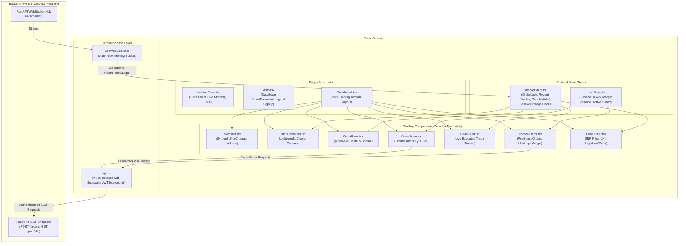
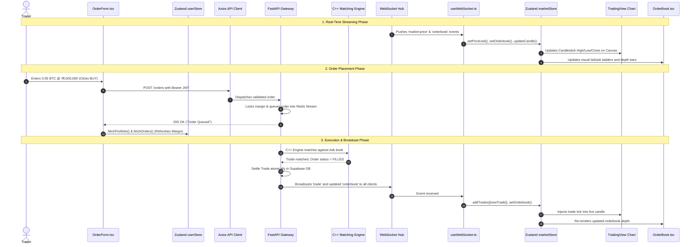

# 🖥️ NanoTrade Frontend — Professional Crypto Trading Terminal

<p align="center">
  
  
  
  
  
  
  
  
  
</p>

---

## 📌 Executive Overview

**NanoTrade Frontend** is a zero-latency crypto paper-trading terminal built with a data-dense, minimalist **Zerodha-inspired trading UX**. It provides institutional-grade trading tools for Indian cryptocurrency traders:

* **Real-Time Market Depth:** Live visual orderbook rendering bids and asks with dynamic depth percentage bars.
* **Hardware-Accelerated Financial Charts:** Integrated **TradingView Lightweight Charts** updating tick-by-tick directly on an HTML5 `<canvas>`.
* **Zero-Lag State Segregation:** High-frequency WebSocket price bursts are decoupled via dual **Zustand** stores, keeping order entry and portfolio views ultra-responsive.
* **Native INR Denomination:** All market prices, margins, order sizes, and PnL are denominated in Indian Rupees (INR) with real-time live currency conversion.
* **Instant Execution Feedback:** Limit and market orders trigger sub-millisecond execution updates, toast notifications, and automatic margin balance reconciliations.

> 📖 **Interview Candidate Notice:** A master, exhaustive interview preparation and system design study guide is included directly inside this folder at [**`INTERVIEW_PREPARATION_GUIDE.md`**](./INTERVIEW_PREPARATION_GUIDE.md).

---

## 🏗️ Frontend Architecture & Component Hierarchy



---

## 🔄 How the Frontend & Backend Work Together

The frontend and backend interact through a synchronized dual-channel pipeline (REST for state mutations + WebSockets for real-time events):



---

## 🎨 UI & Design Standard (Zerodha Philosophy)

* **Terminal Dark Theme:** High-contrast palette (`#161A1E` background, `#2B3139` borders) reducing eye strain during long trading sessions.
* **Strict Semantic Colors:**
  * 🟢 **Buy / Profit / Up:** `#0ECB81`
  * 🔴 **Sell / Loss / Down:** `#F6465D`
  * ⚪ **Neutral / Accent:** `#848E9C` and `#EAECEF`
* **Data Density:** Tight padding, monospaced tabular numerals (`font-mono`), and zero frivolous gradients or slow animations.
* **Live Market Depth Bars:** Orderbook rows show dynamic horizontal percentage volume bars calculated against total book depth.

---

## 📁 Frontend Repository Directory Structure

```text
NanoTrade-frontend/
├── index.html                  # HTML entry point with Inter font import
├── vite.config.ts              # Vite bundler configuration & path aliases (@)
├── tsconfig.json               # TypeScript compiler options
├── package.json                # Dependencies and npm run scripts
├── public/                     # Static assets and icons
├── INTERVIEW_PREPARATION_GUIDE.md  # 🌟 Master System Design & Interview Guide
└── src/
    ├── main.tsx                # React DOM root render
    ├── App.tsx                 # Route switches (Landing, Auth, Terminal Dashboard)
    ├── index.css               # Tailwind CSS base styles & custom color variables
    ├── components/
    │   ├── trading/            # Core trading terminal modules
    │   │   ├── ChartContainer.tsx  # TradingView Lightweight Charts canvas
    │   │   ├── HeroChart.tsx       # Interactive landing page showcase chart
    │   │   ├── LiveMarkets.tsx     # Landing page live market price feed
    │   │   ├── OrderBook.tsx       # Live bid/ask depth ladder
    │   │   ├── OrderForm.tsx       # Limit & market order execution modal
    │   │   ├── PortfolioTabs.tsx   # Margin, open orders, holdings tabs
    │   │   ├── PriceTicker.tsx     # Header bar price & 24h market stats
    │   │   ├── TradeFeed.tsx       # Real-time public trade execution stream
    │   │   └── Watchlist.tsx       # Crypto asset watchlist selector
    │   └── ui/                 # Reusable base components (Tabs, Button, Input)
    ├── hooks/
    │   └── useWebSocket.ts     # Persistent WebSocket hook with auto-reconnect
    ├── lib/
    │   ├── supabase.ts         # Supabase client SDK instance
    │   └── utils.ts            # Tailwind classnames merger (clsx + twMerge)
    ├── pages/
    │   ├── Auth.tsx            # Supabase email/password login & registration
    │   ├── Dashboard.tsx       # Protected Zerodha-style trading terminal
    │   └── LandingPage.tsx     # Marketing hero page with live charts
    ├── services/
    │   └── api.ts              # Centralized Axios client with JWT interceptor
    └── store/
        ├── marketStore.ts      # High-velocity volatile market state (Zustand)
        └── userStore.ts        # User portfolio, balance, orders & session (Zustand)
```

---

## ⚡ State Management Architecture

To prevent UI stutter during heavy market volatility (where WebSockets push 20+ ticks per second), NanoTrade partitions state into two decoupled stores:

### 1. `marketStore.ts` (Volatile Market Data)
* Handles high-frequency streaming events:
  * `orderbook`: `{ bids: [{ price, quantity }], asks: [{ price, quantity }] }`
  * `recentTrades`: Max 100 executed trades, trimmed with `.slice(0, 100)`.
  * `candles`: Dynamic OHLCV candlesticks for the TradingView chart.
* **Live Tick Aggregator (`updateCandle`):** Evaluates trade timestamps and updates the open 1-minute candle's High, Low, and Close in-place without triggering an API fetch.
* Persisted in `sessionStorage` to allow seamless page refreshes without losing chart history.

### 2. `userStore.ts` (User Ledger & Session)
* Handles user-specific sensitive financial data:
  * `balance`: Virtual available INR margin.
  * `holdings`: Array of asset balances, quantities, and volume-weighted purchase prices.
  * `orders`: History of pending (`QUEUED`, `PROCESSING`) and finished (`FILLED`, `CANCELLED`) orders.
* **Zero Data Leakage:** On logout, `clearSession()` explicitly purges all user data from memory and local storage.

---

## ⚙️ Environment Variables

Create a `.env` file in the `NanoTrade-frontend/` directory (or use `.env.example`):

```env
# Backend API Base URL
VITE_API_URL=http://localhost:8000

# Real-Time WebSocket Endpoint
VITE_WS_URL=ws://localhost:8000/ws/market

# Supabase Authentication & Database
VITE_SUPABASE_URL=https://your-project.supabase.co
VITE_SUPABASE_ANON_KEY=your-supabase-anon-public-key
```

*(Note: For remote deployments or tunnels like Cloudflare/ngrok, replace `localhost:8000` with your public HTTPS/WSS URL).*

---

## 🛠️ Setup & Installation Guide

### Prerequisites
* **Node.js** (v18.0.0 or higher)
* **npm** (v9.0.0 or higher)

### 1. Install Dependencies
```bash
cd NanoTrade-frontend
npm install
```

### 2. Configure Environment
```bash
cp .env.example .env
# Open .env and insert your VITE_SUPABASE_URL and VITE_SUPABASE_ANON_KEY
```

### 3. Launch Development Server
```bash
npm run dev
```
The terminal interface will start on **`http://localhost:5173`**.

### 4. Build Production Bundle
```bash
npm run build
```
Generates an optimized, minified production distribution in the `dist/` directory.

---

## 📚 Master Interview Preparation Guide

Are you preparing for an interview where this project is on your resume?  
Read the dedicated **[INTERVIEW_PREPARATION_GUIDE.md](./INTERVIEW_PREPARATION_GUIDE.md)** located directly in this folder. It covers:
* 30-second and 2-minute project elevator pitches.
* Low-latency C++ matching engine data structures and complexity ($\mathcal{O}(\log P)$ vs $\mathcal{O}(1)$).
* Distributed locking and pre-execution margin validation.
* Redis Streams vs Pub/Sub architectural trade-offs.
* Idempotent PostgreSQL RPC trade settlement math.
* 35+ technical interview questions with word-for-word high-scoring answers.
